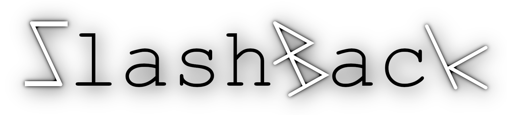

  
## An unsurprising markup language  
SlashBack attempts to make **professional** documentation **easier**\.  
If you ever wanted your **text** to appear **exactly as you wrote it**,  
**SlashBack is for you\!**  
  
The **only character** you need to tell **SlashBack** what to do, is **backslash** \(``` \ ```\)  
It's your **universal tool** to **style your text\!**  
  
  
* **No characters that suddenly vanish** \(or produce unexpected text formatting\)  
* **No cumbersome trickery** to make **indents** or **multiple spaces** \(like "&nbsp;&nbsp;&nbsp;&nbsp;"\)  
* **No need for escape characters** \(the only character you can escape is backslash\)  
  
  
## Using SlashBack  
### Syntax  
**SlashBack**'s syntax is **similar** to the syntax of **HTML**\.  
  
Every **text snippet** that's supposed to be displayed in a **given format** has to be **surrounded by a start and end tag**\.  
Every tag in turn has to be surrounded by backslashes\.  
In other words, a tag begins with a backslash and ends with one\.  
Example:  
&nbsp;&nbsp;&nbsp;&nbsp;Given you want to put a strong emphasis on the word "**money**"\.  
&nbsp;&nbsp;&nbsp;&nbsp;You can do so by writing ``` \b \money\ b\ ```\.  
&nbsp;&nbsp;&nbsp;&nbsp;The "``` b ```"\-tag stands for **bold**\.  
&nbsp;&nbsp;&nbsp;&nbsp;  
  
For reference, look at [README\.sb](https://github.com/Zuzu-Typ/SlashBack/blob/master/README.sb)\.  
  
This very README was composed in SlashBack \(:  
  
